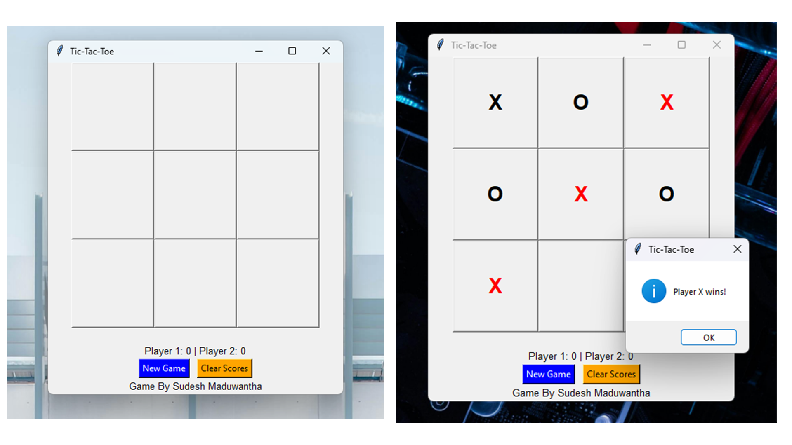

# TIcTacToeGame
This is Tic Tac Toe Game created using Python 

## Screenshots




## Description

This project implements a simple Tic-Tac-Toe game in Python with a graphical user interface (GUI). It allows two players to play the classic game on a 3x3 grid. The game includes features such as score tracking, clearing scores, and a new game option.

## Features

- Two-player mode.
- Graphical user interface (GUI) using Python's Tkinter library.
- Score tracking for Player 1 and Player 2.
- Option to clear scores and start a new game.
- Basic error handling and input validation.

## Screenshots (if applicable)

Include screenshots of your game interface here if you have any.

## Installation

1. Clone the repository:

   ```bash
   git clone https://github.com/SudeshMaduwantha/TIcTacToeGame.git
   cd TIcTacToeGame

2. Install dependencies (if any):
    # Example if using pip
    pip install -r requirements.txt

3. Run the game:
    python tic_tac_toe.py

Usage
    Players take turns clicking on the grid to place their respective symbols (X or O).
    The game will announce the winner when a player achieves three symbols in a row (horizontal, vertical, or diagonal).
    Use the "New Game" button to start a new game and clear the board.
    Use the "Clear Score" button to reset the score tracking.

Contributing
Contributions are welcome! Here's how you can contribute:

    Fork the repository.
    Create a new branch (git checkout -b feature/your-feature).
    Make your changes.
    Commit your changes (git commit -am 'Add new feature').
    Push to the branch (git push origin feature/your-feature).
    Create a new Pull Request.

License
MIT License

Contact
Author: Sudesh Maduwantha Kumarasiri
GitHub: [My GitHub Profile](https://github.com/SudeshMaduwantha)
LinkedIn: [My LinkedIn Profile](https://www.linkedin.com/in/sudesh-maduwantha-486786230)
Email: sudeshmaduwantha205@gmail.com

Feel free to reach out if you have any questions or feedback about the project.

### Notes:

- **Screenshots:** If you have screenshots of your game, include them in a `Screenshots` section or embed them directly in the README.
  
- **Dependencies:** Update the installation instructions based on the dependencies required for your project (`requirements.txt` or otherwise).

- **Contributing:** Provide guidelines for others who might want to contribute to your project.

- **License:** Ensure to include a license file (`LICENSE`) in your repository and reference it in the README.

- **Contact:** Replace placeholders (`https://github.com/SudeshMaduwantha`, `https://www.linkedin.com/in/sudesh-maduwantha-486786230`) with actual links to your profiles.

Feel free to adjust the sections and details to better fit your project's specifics. If you need further customization or have more questions, let me know!

